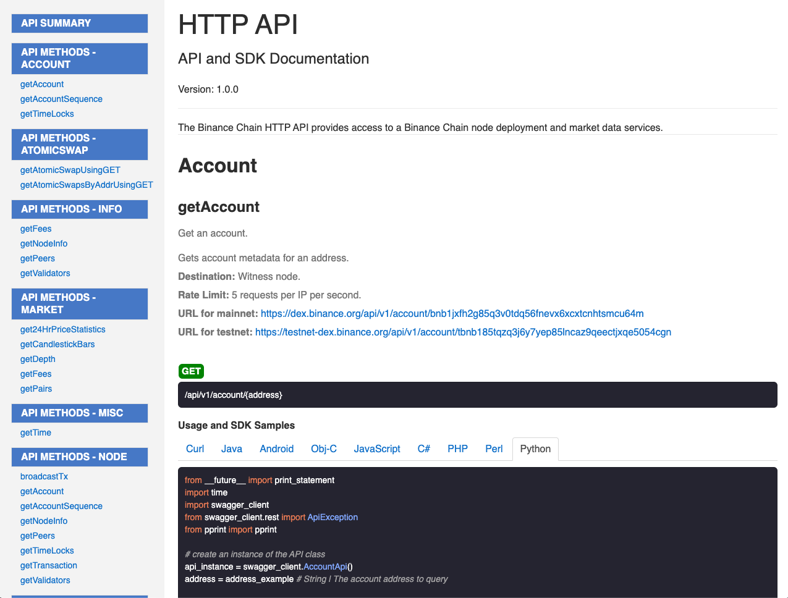

We use Swagger to document the usage of our APIs, with code snippets for both REST calls and SDK samples.

## API Reference

| [API Documentation](https://docs.binance.org/api-swagger/) | [RPC API Documentation](https://docs.binance.org/rpc-swagger/)                            |
| ---------------------------------------------------------- | ----------------------------------------------------------------------------------------- |
|             |                                                  |
| Provides access to account, market data and trade methods  | Provides access to lower-level state, networking, transaction generation and broadcasting |

## SDKs

Binance Chain offers language-specific SDKs that abstract our REST APIs and Node RPC methods for developers.

### Official SDKs

| Language   | Link                                                      | Docs                                                         |
| ---------- | --------------------------------------------------------- | ------------------------------------------------------------ |
| Go         | [Github](https://github.com/binance-chain/go-sdk)         | [Docs](https://github.com/binance-chain/go-sdk/wiki)         |
| Java       | [Github](https://github.com/binance-chain/java-sdk)       | [Docs](https://github.com/binance-chain/java-sdk/wiki)       |
| Javascript | [Github](https://github.com/binance-chain/javascript-sdk) | [Docs](https://github.com/binance-chain/javascript-sdk/wiki) |

### Community SDKs

| Language | Link                                                     | Docs                                                                                                  |
| -------- | -------------------------------------------------------- | ----------------------------------------------------------------------------------------------------- |
| C++      | [Github](https://github.com/binance-chain/cplusplus-sdk) | [Docs](https://github.com/binance-chain/cplusplus-sdk/wiki)                                           |
| C#       | [Github](ht;tps://github.com/binance-chain/csharp-sdk)   | [Docs](https://github.com/binance-chain/csharp-sdk)                                                   |
| Python   | [Github](https://github.com/binance-chain/python-sdk)    | [Docs](https://python-binance-chain.readthedocs.io/en/latest/binance-chain.html#module-binance_chain) |
| Swift    | [Github](https://github.com/binance-chain/swift-sdk)     | [Docs](https://github.com/binance-chain/swift-sdk/blob/master/README.md)                              |

If you are interested in developing new SDKs in other languages (e.g. Rust, Haskell), please contact us directly.
